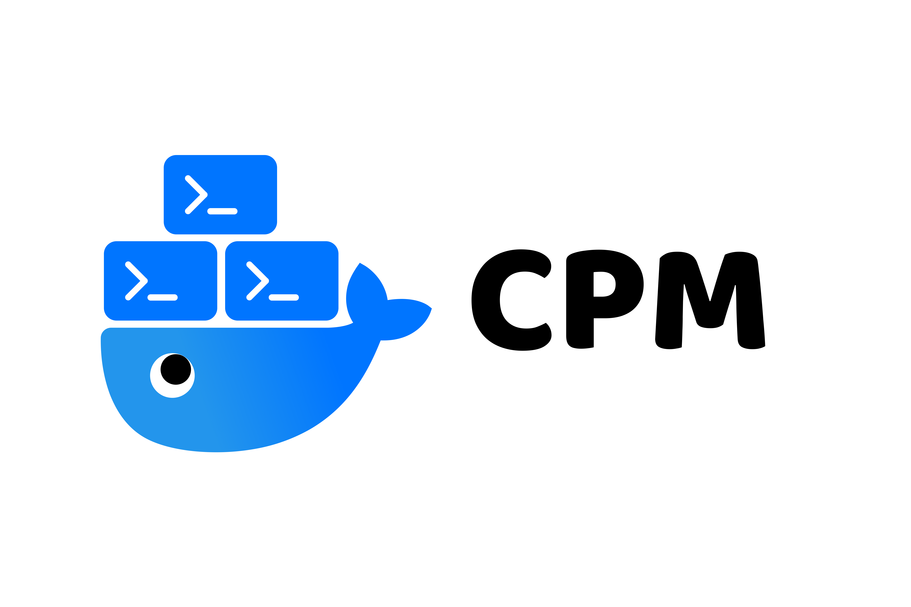

<p align="center">
    
</p>

[](https://github.com/ellerbrock/open-source-badges/)
[](https://golang.org/)
[](https://github.com/gomods/athens)
[](https://goreportcard.com/report/github.com/n1ckl0sk0rtge/cpm)

> cpm is currently under development. There is no official release at 
> the moment. Be aware that by installing the current state the application 
> is not stable and may contain breaking changes.

## Install

```shell
go install github.com/n1ckl0sk0rtge/cpm
```

## What is cpm?

cpm is a command line tool for using container technology
to run command line applications. Instead of installing, 
running and managing native binaries for your device 
(as is the case with homebrew or apt), cpm allows using 
OCI images to use any cli-application regardless of the 
operating system. It supports:

- create cli commands that executes a desired image with parameters.
- delete created commands if desired
- manage commands by listing them and displaying information about them
- update the underlying images of the commands with a single instruction

With cpm you can replace your local cli-tools with isolated
OCI images and manage them in the same way as with other package managers.

## Create new cli-commands

To create/install a new command, you must call the
create option and specify the required parameters. The
following parameters can be configured:
- `name` of the new command (by which name you will call and execute the command)
- the OCI `image` which will be executed and contains the tool
- optional a specific `tag` for the image, otherwise 'latest' is used
- optional the `command` to be executed inside the container
- optional `parameters` for running the container, defaults are '-rm -i -t'

Examples:
```shell
cpm create redis-cli redis:latest -c redis-cli
cpm create golang@1.17 golang:1.17-stretch -p '-rm -i -t -v "$PWD":/usr/src/app -w /usr/src/app' -c go
```

## Configure

The following options can be configured globally for cpm:

- `Execution path:` This value determines where the new commands are created.
  The default path is `/usr/local/bin`. If you change this value, make sure that the new
  path is added to `$PATH`, otherwise the execution of the created commands will not work.
- `Runtime:` Define the container runtime that will be used to execute the 
commands/run the containers. The default is `docker`. Others are not officially supported,
but may work too.
- `Socket:` Set the container runtime socket. The default is `/var/run/docker.sock`.

The values can be changed by the following command:
```shell
cpm config set PROPERTY_NAME PROPERTY_VALUE 
```

## Testing

To test cpm, there is a Dockerfile in the `tests` folder that creates the necessary 
test environment. To create the environment/image `cpm-testenvironment:latest` run 
the following command:
```shell
make testenv
```
This environment uses docker-in-docker to run the tests in isolation.

Now you can run the go tests for cpm in this environment by executing the following command:
```shell
make tests
```

___
[Apache 2.0 License](LICENSE) © Nicklas Körtge